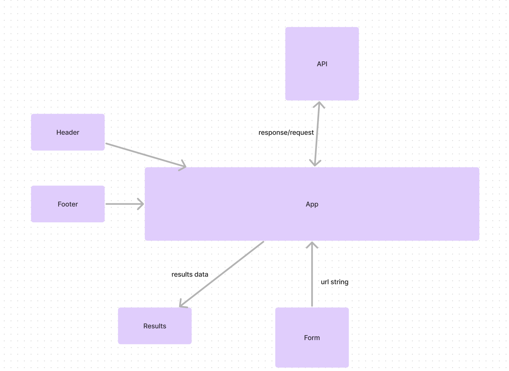

# RESTy

**Author**: Brendan McMullen
**Version**: 1.0.2

## Overview
This is a basic rest api with the abiity to fetch data from a url.

## Getting Started
Type the url into the form and click "GO" to make a get request.

## Architecture
    "axios": "^1.7.2",
    "react": "^18.2.0",
    "react-dom": "^18.2.0",
    "sass": "^1.77.4",
    "uuid": "^9.0.1"
    "babel-jest": "^29.7.0",
    "jest": "^29.7.0",
    "vite": "^5.2.0"

## Credit and Collaborations
chatgpt

## UML Diagram
